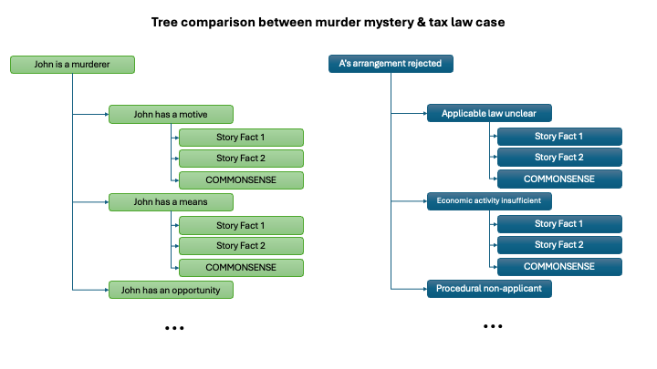

# MuSR-TaxLaw: German Tax Law Case Generation

### A modified version of MuSR for generating German tax law cases that require multi-step legal reasoning

**Based on the original MuSR framework by Zayne Sprague, Xi Ye, Kaj Bostrom, Swarat Chaudhuri, and Greg Durrett.**

This repository is a fork and adaptation of the original [MuSR project](https://zayne-sprague.github.io/MuSR/) ([paper](https://arxiv.org/abs/2310.16049), ICLR 2024) specifically modified for generating complex German tax law cases. The original MuSR framework has been adapted to create legal reasoning scenarios in the domain of German tax law.

**Original Authors:** zayne@utexas.edu {xi, kaj, swarat, gdurrett}@cs.utexas.edu

**Modifications:** This fork modifies the domain-specific components, sampling logic, and prompting strategies to generate German tax law cases while preserving the core MuSR reasoning framework.

## Installation

**Note**: The project has been tested with Python 3.10.

**Option 1: Using Conda with Editable Install (Recommended)**
1. `conda create -n myenv python=3.10`
2. `conda activate myenv`
3. `pip install -e .`

**Option 2: Using Virtual Environment with Editable Install**
1. `virtualenv venv` (tested with python 3.10)
2. `source venv/bin/activate`
3. `pip install -e .`

**Option 3: Manual Requirements Install**
1. Create and activate your environment (conda or virtualenv)
2. `pip install -r requirements.txt`


## Evaluation

To run the evaluation script on the German tax law case datasets:
```shell
cd eval
OPENAI_API_KEY=key python eval.py
```

You can edit the functionality of the evaluation in eval.py as well (including different prompting strategies, models, and more).

## Generating German Tax Law Case Datasets

The German tax law case creation script is in `{project_root}/musr_dataset_scripts/create_german_tax_law_case.py`.

To run the script:

```shell
OPENAI_API_KEY=key python musr_dataset_scripts/create_german_tax_law_case.py
```
The generated dataset will be saved in datasets/german_tax_law_case.json

## Key Implementation


### Domain Seed Replacement

### CrewAI Integration for Modular Prompt Management

Unlike the murder mystery domain which uses a single prompt for tree node expansion, German tax law case domain requires component and depth-specific prompts. Therefore, we integrated CrewAI for dynamic prompt management and made structural changes to the `src` directory.

The new `src/crews/` directory contains:
- **agents.py**: Specialized agents for different aspects of tax law reasoning (legal, economic, procedural)
- **tasks.py**: Task definitions for different reasoning components
- **config/prompts/**: Modular prompt templates organized by domain:
  - `law.py`: Legal reasoning prompts
  - `econ.py`: Economic analysis prompts  
  - `proc.py`: Procedural compliance prompts
  - `story.py`: Narrative generation prompts
- **tree_builder.py**: CrewAI-integrated tree expansion logic
- **runner.py**: Orchestrates the multi-agent reasoning process


### Viewing Generated Cases

After running the dataset generation script, you can view the generated German tax law cases in an interactive HTML format:

- **HTML Visualization**: Open `german_tax_law_case.html` in your browser to see a side-by-side comparison of generated tax law cases
- **Features**: 
  - Interactive reasoning tree visualization with collapsible nodes
  - Detailed case stories and metadata
  - Color-coded fact types (explicit vs. commonsense knowledge)
  - Question-answer format for evaluation

The HTML file provides a comprehensive view of:
- Business sector and transaction type context
- Taxpayer and tax authority information
- Decision outcomes (accept with conditions, fully reject, etc.)
- Complete reasoning trees with logical operators
- Generated court decision narratives

### Example Generated Case

You can see an example of the generated German tax law cases by opening [assets/german_tax_law_case_ex.html](assets/german_tax_law_case_ex.html) in your browser.


